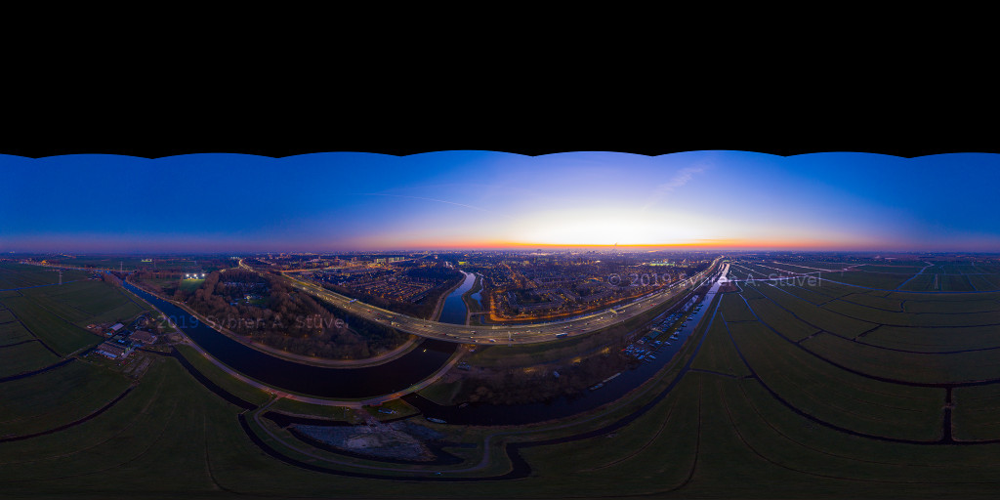
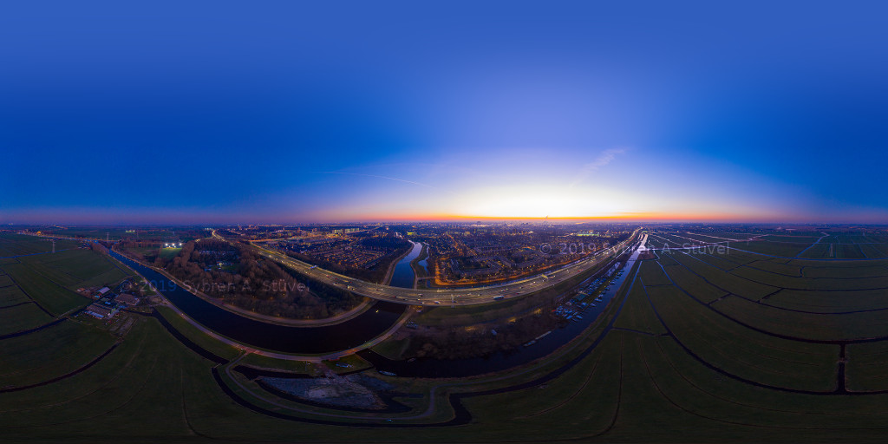
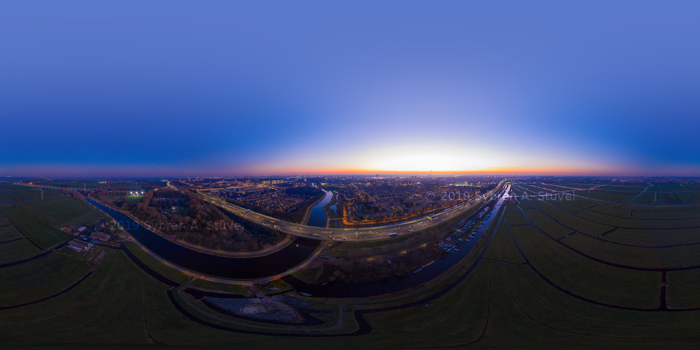
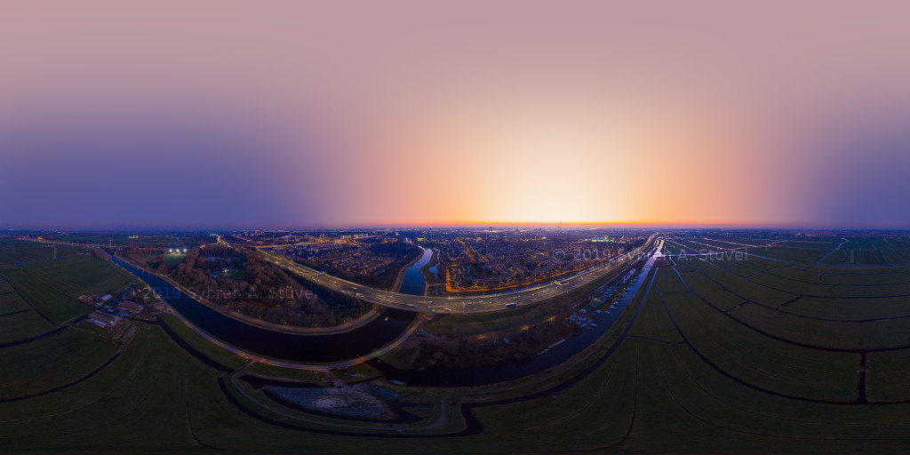
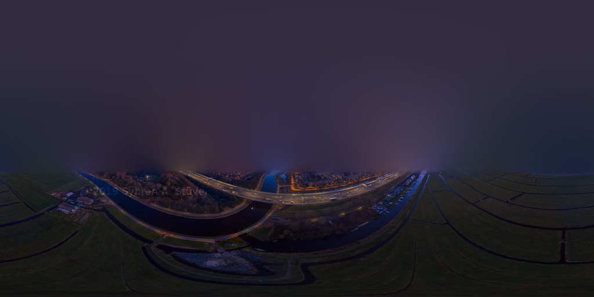

# Skyfill

Most drones (UAVs) cannot look straight up to photograph the sky above them. As a result, spherical panoramas made with drones tend to have a gap in the sky. Some drones, like the DJI Mavic 2, can fill in this gap automatically while generating a preview. **Skyfill allows you to do fill in those gaps in the sky in high-resolution images.**

## [Download Skyfill](https://gitlab.com/dr.sybren/skyfill/-/releases)

Skyfill releases can be [downloaded from Gitlab](https://gitlab.com/dr.sybren/skyfill/-/releases).

## Example Images

Before (left/above) and after (right/below) applying Skyfill with the default options.

## Basic Usage

Skyfill reads 8-bit PNG, TIFF, and JPEG files. It writes 8-bit JPEG files if the input is 8-bit, and 16-bit TIFF files if the input is 16-bit. It assumes the colour space is sRGB, unless the `-adobergb` parameter is used.

The basic way to run Skyfill is `skyfill input-file.png`. On Windows it is possible to simply drop an image file onto the `skyfill.exe` file.

## Mirror Ball

The sky part can be made a bit more interesting by creating a so-called *mirror ball* that reflects the ground. This results in a mini planet version of the panorama, hanging in the sky. To see what it looks like, check https://stuvelfoto.nl/panorama/tulpen-rood-geel-120m-mirrorball/

Run Skyfill with `skyfill -mirrorball input-file.png` to enable this mode.

## Advanced Usage

There are several commandline options to influence the result:

* `-adobergb`: Use this if the input is in AdobeRGB to have slightly better blending of the sky.
* `-lower-sky {percentage}`: Skyfill automatically detects the edge of the sky gap by finding black or transparent pixels. This option lowers the detected edge by a percentage of the detected gap height. For example, if you want to lower where Skyfill starts filling in the sky gap by 10% of the gap height, use `-lower-sky 10`.
* `-blend {percentage}`: To prevent a hard edge between the photographed sky and the generated sky, Skyfill uses 10% extra space to blend between them. If you want a smoother blend, for example 20%, use `-blend 20`. To see the hard edge use `-blend 0`.
* `-quiet`: Show less information on the terminal (only warnings and errors).
* `-help`: Show all available commandline options, then quit.

With 80% blend size (left/above), and with a 50% (middle) and 80% (right/below) lower sky edge.

When passing those parameters, do so before the input image filename. For example: `skyfill -lower-sky 20 -blend 30 input-image.png`

## Debugging

For debugging purposes these options can be used:

* `-bounds`: Draws a horizontal line to indicate the lower bound of the sky gap, and another line to indicate the lower bound of the blend area (a.k.a. "extra sky", see `-blend` above). It also draws a blend weight indication in the blend area.
* `-samples`: Draws a red dot on each sample point of the generated sky. The sky colours are interpolated linearly between those sample points.
* `-debug`: enable debug logging.

## Copyright & License

Copyright © 2019 by [Sybren A. Stüvel](https://stuvelfoto.nl/panorama).

Skyfill is free software: you can redistribute it and/or modify it under the terms of the GNU General Public License as published by the Free Software Foundation, either version 3 of the License, or (at your option) any later version.

Skyfill is distributed in the hope that it will be useful, but WITHOUT ANY WARRANTY; without even the implied warranty of MERCHANTABILITY or FITNESS FOR A PARTICULAR PURPOSE.  See the GNU General Public License for more details.

You should have received a copy of the GNU General Public License along with Skyfill.  If not, see https://www.gnu.org/licenses/.

The images used in this documentation are created by and copyright © 2019 by Sybren A. Stüvel. They can be freely distributed but only used or otherwise displayed as part of documentation for or demonstration of Skyfill, and any usage must credit [Sybren A. Stüvel](https://stuvelfoto.nl/panorama) as the photographer.
